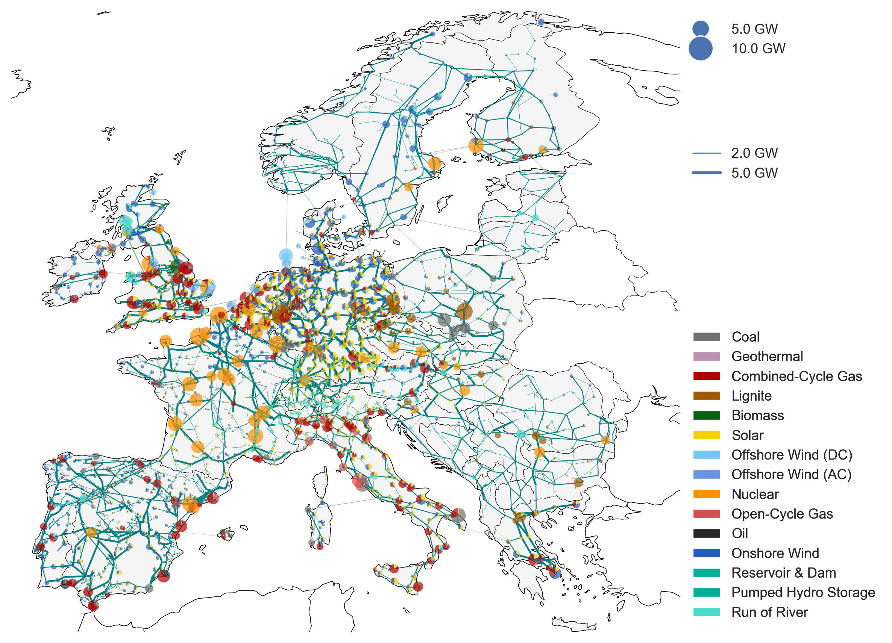

<!--
SPDX-FileCopyrightText: 2017-2023 The PyPSA-Eur Authors
SPDX-License-Identifier: CC-BY-4.0
-->

.

# Modelling Flexibility in a Whole-System Power Model

In this repo we explore whole-system implications of demand flexibility events as in [The Big Dirty Turn Down](https://www.centrefornetzero.org/work/energy-flexibility-domestic-research-octopus-energy/).

For this purpose, we make modifications to the energy model [PyPSA-Eur](github.com/pypsa/pypsa-eur), which is a linear model of the European energy system that optimises both operation and capacity expansion.

The present repo is a work in progress, but will feature interactive scenario presentations, and a ready-to-use pipeline to conduct various experiments.

For more details on the underlying PyPSA-Eur model, we refer to the [model documentation](https://pypsa-eur.readthedocs.io) or related research for instance [PyPSA-Eur: An Open Optimisation Model of the European Transmission System](https://arxiv.org/abs/1806.01613), 2018, [arXiv:1806.01613](https://arxiv.org/abs/1806.01613). The model building routines are defined through a snakemake workflow.  Please see the [documentation](https://pypsa-eur.readthedocs.io/) for installation instructions and other useful information about the snakemake workflow. The model is designed to be imported into the open toolbox [PyPSA](https://github.com/PyPSA/PyPSA).

The network is built up on the transmission network nodes from [PyPSA-Eur](https://github.com/PyPSA/pypsa-eur):

For computational reasons the model is usually clustered down
to 50-200 nodes.

Already-built versions of the model can be found in the accompanying [Zenodo
repository](https://doi.org/10.5281/zenodo.3601881).

# Licence

The code in this repository is released as free software under the [MIT License](https://opensource.org/licenses/MIT), see `LICENSE.txt`.  However, different licenses and terms of use may apply to the various input data.

There are two Github Actions workflows:

* `test_and_lint.yaml` runs checks on a Ubuntu Github-hosted runner.
* `container.yaml` runs the same checks but inside a Docker container and pushes images to [Google Cloud Platform Artifact Registry](https://cloud.google.com/artifact-registry).

## Secrets configuration

If you want to use the Docker workflow, you need to set the following secrets:

* `GCP_ARTIFACT_REGISTRY`, e.g. `LOCATION-docker.pkg.dev/PROJECT-ID`
* `GCP_ARTIFACT_REGISTRY_SA_KEY`, the key for a service account with the roles to push and pull images.

## Repo Setup

You need to [set up your Python environment](https://docs.google.com/document/d/1Tg0eKalqOp-IJEeH7aShc9fYF5zn95H6jxEk25BLLUE/) first.

1. Clone this repo.
2. Install `micromamba`. If you're on a mac, use `brew install micromamba`
3. Run `micromamba env create -f envs/environment.yaml`
4. Run `micromamba activate pypsa-eur`
