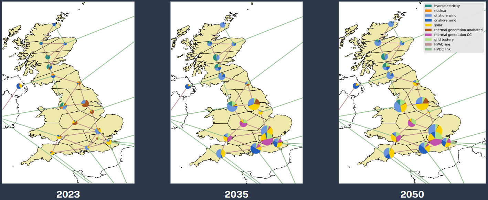
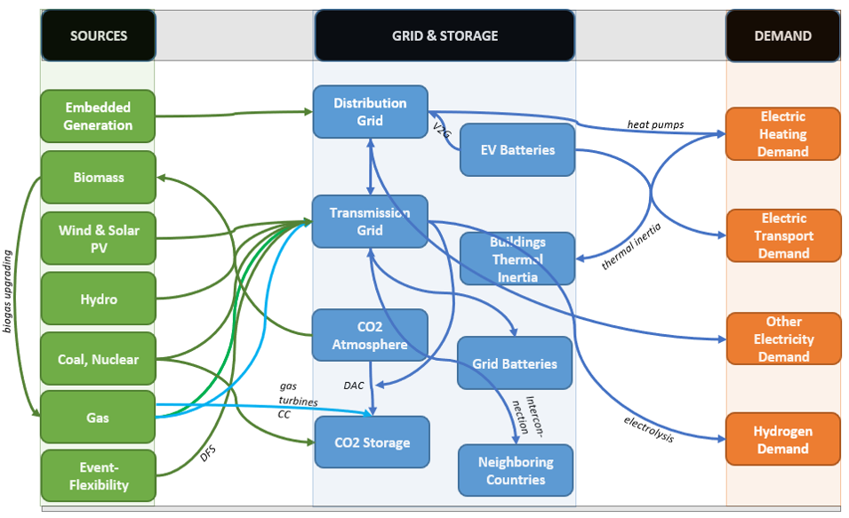

[comment]: # (PyPSA README)

<!--
SPDX-FileCopyrightText: 2017-2023 The PyPSA-Eur Authors
SPDX-License-Identifier: CC-BY-4.0
-->

<!--
-->
<!---->
   
<!---->
<!---->
<!--.-->

# PyPSA-FES: A linear optimisation model to simulate Great Britain's energy transition

PyPSA-FES offers a complete data pipeline and optimisation backbone to model any year between 2023 and 2050 of Great Britain's energy transition both for an optimisic transition scenario _Leading the Way_, and a pessimistic version _Falling Short_. For the chosen scenario and year, the model dynamically retrieves parameters on generation, transmission and storage capacities, demand and emission targets from [_national grid ESO's Future Energy Scenarios_](https://www.nationalgrideso.com/future-energy/future-energy-scenarios), and runs a full year of hourly investment and operational optimisation for a 16-zonal network. Neighbouring countries are modelled as single nodes, to realistically capture opportunities for electricity trading via interconnectors.

Our model builds on the highly popular [PyPSA-Eur model](github.com/pypsa/pypsa-eur), which has been adapted to focus on the electricity sector in the United Kingdom.

For details on installation, tutorial, and a deeper overview of model assumptions we refer to the [documentation](https://pypsa-eur.readthedocs.io/en/latest/).

Additionally, the model includes three types of domestic demand flexibility, that can be switched on or off
- **Demand Flexibility Service**; individual households shifting their demand in time.
- **Smart Heat Pumps** storing heat provided by heat pumps in homes' thermal inertia.
- **Smart Charging Electric Vehicles** and **Vehicle-to-Grid** according to centrally optimised schedules.

While only considering electricity demand, the model aims to assume a role that fits with the transition of the larger multi-sector energy system:

- Increased electricity demand due to electrification of heat and transport.
- Negative emissions using carbon capture and storage, simulating carbon trading with hard to abate sectors.
- Competition for biomass supply with other sectors.

The model is an adaption of the [PyPSA-Eur](github.com/pypsa/pypsa-eur), a sector-coupled european energy model, developed at [TU Berlin](https://www.tu.berlin/en/ensys), built on the underlying Python modelling library [PyPSA](github.com/pypsa/pypsa). For more details on the underlying PyPSA-Eur model, we refer to the [model documentation](https://pypsa-eur.readthedocs.io) or related research for instance [PyPSA-Eur: An Open Optimisation Model of the European Transmission System](https://arxiv.org/abs/1806.01613), 2018, [arXiv:1806.01613](https://arxiv.org/abs/1806.01613). 

The model is governed through a __snakemake__ workflow.  Please see the [documentation](https://pypsa-eur.readthedocs.io/) for installation instructions and other useful information about the snakemake workflow. The model is designed to be imported into the open toolbox [PyPSA](https://github.com/PyPSA/PyPSA).

# Contributing and Support
We strongly welcome anyone interested in contributing to this project. If you have any ideas, suggestions or encounter problems, feel invited to file issues or make pull requests on GitHub.
-   For questions and comments please contact Lukas Franken via <lukas.franken@ed.ac.uk>.
-   For **bugs and feature requests**, please use the [PyPSA-FES Github Issues page](https://github.com/centrefornetzero/pypsa-fes/issues).

# Licence

The code in this repository is released as free software under the [MIT License](https://opensource.org/licenses/MIT), see `LICENSE.txt`.  However, different licenses and terms of use may apply to the various input data.