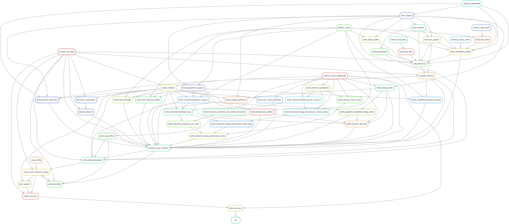

..
  SPDX-FileCopyrightText: 2019-2023 The PyPSA-Eur Authors, Lukas Franken

  SPDX-License-Identifier: CC-BY-4.0

####################################################################################
PyPSA-FES: A Linear Optimisation Model to Simulate Great Britain's Energy Transition
####################################################################################

.. image:: https://readthedocs.org/projects/pypsa-fes/badge/?version=latest
    :target: https://pypsa-fes.readthedocs.io/en/latest/?badge=latest
    :alt: Documentation

.. image:: https://img.shields.io/github/repo-size/LukasFrankenQ/pypsa-fes
    :alt: GitHub repo size

.. image:: https://zenodo.org/badge/DOI/10.5281/zenodo.3520874.svg
    :target: https://doi.org/10.5281/zenodo.3520874

.. image:: https://img.shields.io/badge/snakemake-≥7.19-brightgreen.svg?style=flat
    :target: https://snakemake.readthedocs.io
    :alt: Snakemake

..
    .. image:: https://api.reuse.software/badge/github.com/LukasFrankenQ/pypsa-fes
        :target: https://api.reuse.software/info/github.com/LukasFrankenQ/pypsa-fes
        :alt: REUSE

PyPSA-FES is an open model of the Great Britain Power System to
simulate *Future Energy Scenarios* (FES) from National Grid ESO.
The model includes options to include different domestic demand
flexibility options, in particular *Demand Flexibility Service*-style events,
*electric vehicles* with or without *vehicle-to-grid*, and *heat pumps*.

The model is an adaptation of `PyPSA-Eur <https://github.com/pypsa/pypsa-eur>`_, 
a highly popular open-source European energy system model, developed
at Technical University of Berlin.

Modelling the GB Electricity System
===================================

Our modelling of the power system directly uses the data pipeline of the underlying
PyPSA-Eur model. It contains alternating current lines at
and above 220 kV voltage level and all high voltage direct current lines,
substations, an open database of conventional power plants, time series for
electrical demand and variable renewable generator availability, geographic
potentials for the expansion of wind and solar power.

We model Great Britain in *16 zones* chosen to capture bottlenecks in the
transmission network. For demand, we take yearly profiles from ENTSO-E, 
scaled to estimated yearly total demands.

The model formulation lends itself both to operational studies and generation and
transmission expansion planning studies.

.. image:: img/fes_capacity_expansion.png
    :class: full-width
    :align: center

Future Energy Scenarios
=======================

To model future years, we draw on the predicted energy transition scenarios
created by national grid ESO, *Future Energy Scenarios* (FES). These provide
different sector-coupled pathways to net-zero emissions by 2050, lining out 
(among two others) one optimistic, *Leading the Way*, and one more conservative,
*Falling Short* scenario. These two are included in our model.

To accomodate both the cost-optimisation backbone of our model, but also the fixed
quantities that define the scenarios, *we fix all capacities in the model that
can be loosely defined as targets*, and leave it to the model to optimize the
quantities that are required to balance the system around them.

For instance, we fix the total installed capacity of wind and solar power
(just the overall capacity, the model decides how to distribute it), the
total yearly emission targets, and rollout for flexibility providing 
infrastructure, like electric vehicles and heat pumps.

The Future Energy Scenarios consider a sector-coupled version of the energy
system, and aims at achieving net-zero emissions within the next decades.
Due to the electrification of the transport and heating sectors, negative
emissions targeted in the easy-to-abate electricity sector, and fuel competition 
with other sectors, for instance with biomass, the constraints imposed by
integration in the larger system are included in the model.

.. image:: img/pypsa_fes_flowchart.png
    :class: full-width
    :align: center

The Origin Model PyPSA-Eur
==========================

PyPSA-Eur a sector-coupled energy system covering the whole of Europe
which was adapted to build the present model.
For a great overview of the respective capabilities we refer to the
model's `documentation <https://pypsa-eur.readthedocs.io>`_ or the 
Github `repository <https://github.com/pypsa/pypsa-eur>`_.

.. warning::
    PyPSA-FES is under active development and has several
    `limitations <https://pypsa-eur.readthedocs.io/en/latest/limitations.html>`_
    which you should understand before using the model. In case questions arise,
    please reach out to **lukas.franken@ed.ac.uk**.

This project is currently maintained by  `Centre for Net Zero of Octopus 
Energy  <https://www.centrefornetzero.org>`_ in London.

Workflow
========

.. note::
    The graph above was generated using
    ``snakemake --rulegraph -F | sed -n "/digraph/,/}/p" | dot -Tpng -o workflow.png``

Learning Energy System Modelling
================================

If you are (relatively) new to energy system modelling and optimisation and plan
to use PyPSA-Eur, the following resources are one way to get started in addition
to reading this documentation.

- Documentation of `PyPSA <https://pypsa.readthedocs.io>`__, the package for
  modelling energy systems which PyPSA-Eur uses under the hood.
- Course on `Energy Systems <https://nworbmot.org/courses/es-22/>`_ given at
  Technical University of Berlin by `Prof. Dr. Tom Brown <https://nworbmot.org>`_.
- Course on `Data Science for Energy System Modelling <https://fneum.github.io/data-science-for-esm/intro.html>`_
  given at Technical University of Berlin by `Dr. Fabian Neumann <https://neumann.fyi>`_.

.. toctree::
   :hidden:
   :maxdepth: 1
   :caption: Getting Started

   introduction
   installation
   tutorial

..
    .. toctree::
    :hidden:
    :maxdepth: 1
    :caption: Configuration

    wildcards
    configuration
    foresight
    costs

.. toctree::
   :hidden:
   :maxdepth: 1
   :caption: References

   licenses
   contributing
